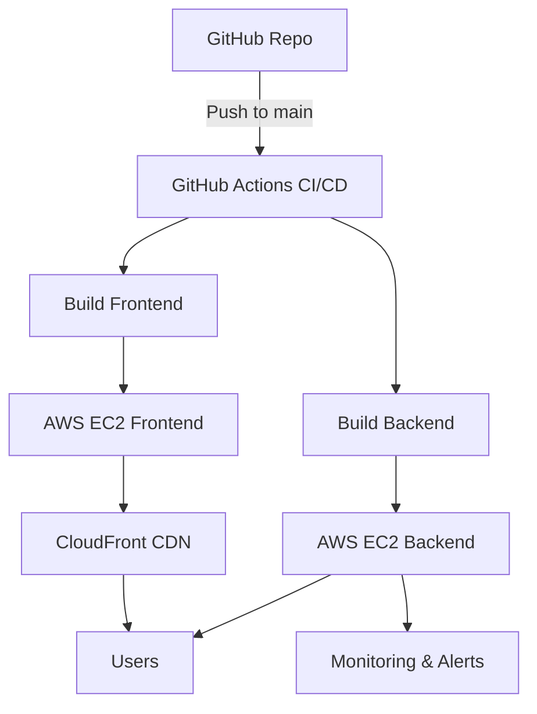

Absolutely! I’ve polished your README to make it **visually clean, professional, and GitHub-ready**, fixing formatting, badges, and the architecture section so it renders correctly. Here’s the improved version:

---

# 🌟 Exilieen Full Stack Project


**Exilieen** is a full-stack web application with **React + Vite frontend** and **Node.js backend**, fully deployed on **AWS EC2**, served via **CloudFront CDN**, automated **CI/CD pipeline**, and **real-time monitoring dashboards with alerts**.

---

## 🚀 Features

* ⚡ **Fast Frontend**: React + Vite ensures optimized performance and fast builds.
* 🔧 **Backend API**: Node.js + Express handles data processing, API requests, and business logic.
* 🛠️ **CI/CD Pipeline**: Fully automated deployment using GitHub Actions.
* 🌍 **CloudFront CDN**: Serves frontend assets globally for low latency and high availability.
* 📊 **Monitoring & Alerts**: Tracks server health, performance, and sends notifications.
* ☁️ **AWS EC2 Hosting**: Both frontend and backend hosted on EC2 instances.
* 🔐 **HTTPS Support**: SSL certificates configured for secure communication.

---

## 🗂 Project Structure

```
Exilieen-Full-Project/
├── CloudFormation/         # AWS infrastructure templates
├── frontend/               # React + Vite frontend
├── backend/                # Node.js + Express backend
├── .github/workflows/      # CI/CD pipeline
└── README.md               # Project documentation
```

---

## 🛠️ Tech Stack

| Component  | Technology                         |
| ---------- | ---------------------------------- |
| Frontend   | React, Vite                        |
| Backend    | Node.js, Express                   |
| Hosting    | AWS EC2                            |
| CDN        | AWS CloudFront                     |
| CI/CD      | GitHub Actions                     |
| Monitoring | AWS CloudWatch / Custom Dashboards |
| Security   | HTTPS / SSL Certificates           |

---

## 🏗️ Architecture Overview



**Explanation:**

* **GitHub Actions**: Automates build, test, and deployment for frontend & backend.
* **EC2 Instances**: Hosts frontend and backend.
* **CloudFront**: Caches frontend assets for fast global delivery.
* **Monitoring**: Tracks backend performance and triggers alerts on issues.

---

## 📦 Deployment Process

### 1️⃣ CloudFormation (Infrastructure as Code)

* Creates **EC2 instances** for frontend and backend.
* Sets up **security groups**, ports, and networking.
* Configures **CloudFront distribution** for frontend.
* Ensures **repeatable and scalable infrastructure**.

### 2️⃣ CI/CD Pipeline (GitHub Actions)

* Triggers on **push to main branch**.

**Frontend Steps:**

1. Install dependencies
2. Run tests
3. Build production-ready code
4. Deploy build to EC2 frontend instance

**Backend Steps:**

1. Install dependencies
2. Run tests
3. Deploy backend to EC2 using `pm2`

* Ensures **automatic deployment and reduces manual errors**.

### 3️⃣ Monitoring & Alerts

* Tracks **CPU, memory, network usage** on EC2 instances.
* Sends **alerts via email or Slack** for downtime or errors.
* Ensures **quick troubleshooting and uptime maintenance**.

### 4️⃣ Frontend & Backend Deployment

#### Frontend

```bash
cd frontend
npm install
npm run build

# Copy build to EC2
scp -r dist/ ubuntu@<FRONTEND_EC2_IP>:/var/www/html
```

#### Backend

```bash
cd backend
npm install

# Copy backend to EC2
scp -r ./ ubuntu@<BACKEND_EC2_IP>:/home/ubuntu/backend

# SSH into EC2 and start server
ssh ubuntu@<BACKEND_EC2_IP>
cd backend
pm2 start index.js --name backend
```

#### CloudFront & HTTPS

* Configure CloudFront to serve **frontend build files**.
* Attach **SSL certificate** for HTTPS.

---

## 🌐 Demo URLs

* **Frontend (HTTPS)**: `https://<FRONTEND_EC2_IP>`
* **Backend API (HTTPS)**: `https://<BACKEND_EC2_IP>`

*(Replace `<FRONTEND_EC2_IP>` and `<BACKEND_EC2_IP>` with your EC2 public IPs or CloudFront URL.)*

---

## 💻 Quick Setup Guide

```bash
# Clone repository
git clone https://github.com/shivamshete92/exilieen-full-project.git
cd exilieen-full-project

# Frontend
cd frontend
npm install
npm run dev      # Development
npm run build    # Production

# Backend
cd ../backend
npm install
npm start        # Development
pm2 start index.js --name backend  # Production
```

* Configure **CloudFront** and **SSL certificate**
* GitHub Actions handles automatic deployment for future updates.

---

## 🏷️ Badges


---

## 📄 License

MIT License

---
